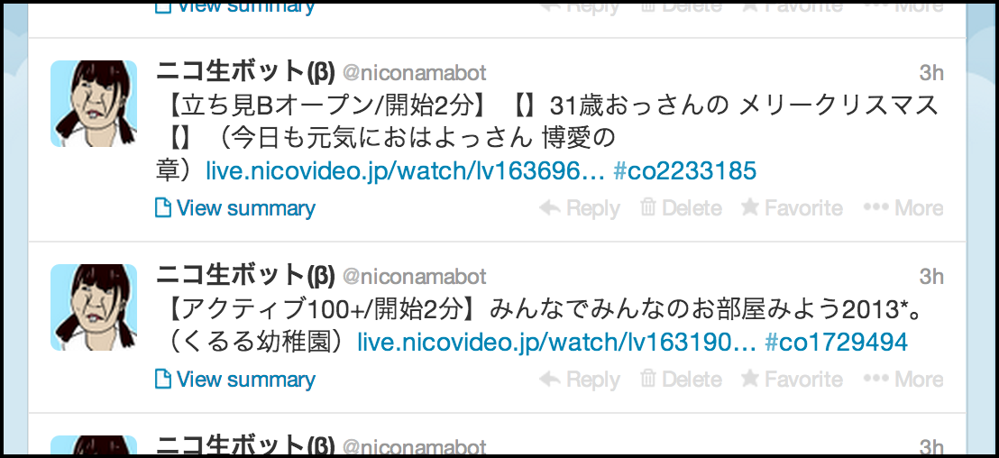
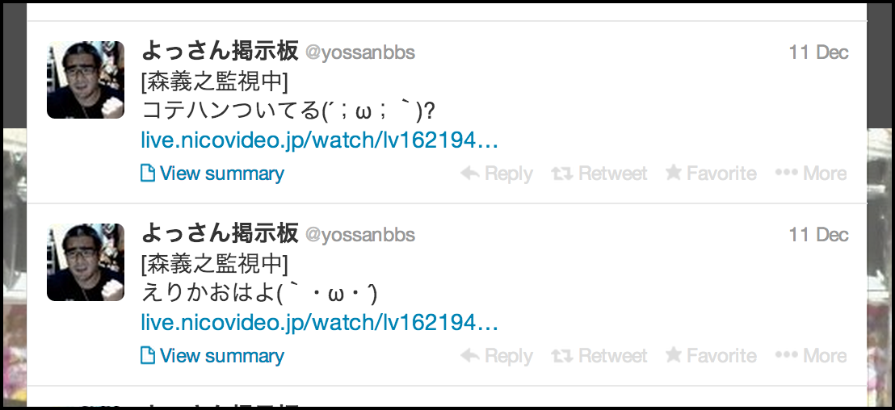

nicocomment
==
an implementation to monitor all niconama broadcast lives.
* tweet popular lives using the following indexes.
    1. active users
    2. participants
* tweet specified user's comments.

sample
-------------
popular lives.



user comments.



* http://www.nicovideo.jp/watch/sm22365097
* http://www.nicovideo.jp/watch/sm22431441

requirements
--
* python 2.7.x
    * versions except 2.7.x are not tested

setup
--
first, setup runtime environment.
````
$ git submodule update --init
$ virtualenv --distribute venv
$ source ./venv/bin/activate
$ pip install http://sourceforge.net/projects/pychecker/files/pychecker/0.8.19/pychecker-0.8.19.tar.gz/download
$ sudo apt-get install libxml2-dev libxslt-dev
$ pip install -r requirements.txt
````

then configure application specific settings. see the sample configuration contents for details.
````
$ cp ./nicocomment.config.sample ./nicocomment.config
$ vi ./nicocomment.config
````

configure environment
--
nicocomment requires lots of os resources, please tune the system as followings.

first, check the current resource limit configuration.
````
$ ulimit -a
````

then configure the max open files and max open processes settings.
````
$ sudo vi /etc/security/limits.conf

# for opening tons of sockets to comment servers.
honishi soft nofile 65536
honishi hard nofile 65536

# for forking thread in the live comment listening.
# thread is treated as process internally in the kernel that uses NPTL(Native POSIX Thread Library)
honishi soft nproc 65536
honishi hard nproc 65536
````

restart the box and check the settings above are successfully configured.
````
$ sudo reboot
$ ulimit -a
````

start & stop
--
start.
````
$ ./nicocomment.sh start
````
stop.
````
$ ./nicocomment.sh stop
````

monitoring example using crontab
--
see `nicocomment.sh` inside for the details of monitoring.

	# monitoring nicocomment
	* * * * * /path/to/nicocomment/nicocomment.sh monitor >> /path/to/nicocomment/log/monitor.log 2>&1

license
--
copyright &copy; 2013- honishi, hiroyuki onishi.

distributed under the [MIT license][mit].
[mit]: http://www.opensource.org/licenses/mit-license.php
